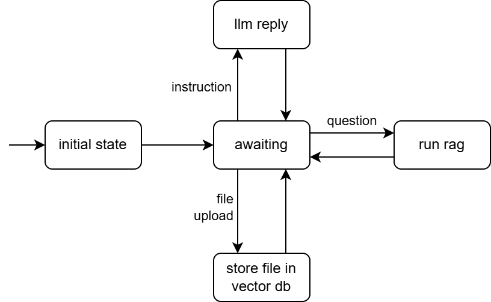

# Lab Guide 4: Building agents with BESSER Agentic Framework

## Welcome to our BESSER lab guide!

In this guide, you will use [BESSER Agentic Framework](https://github.com/BESSER-PEARL/BESSER-Agentic-Framework) (BAF)
to design smart agents.

BAF is a Python library with which you can design agents with rule-based behaviours but also take advantage of AI components like LLMs.

[BAF Documentation](https://besser-agentic-framework.readthedocs.io/latest/)
[BAF Code](https://github.com/BESSER-PEARL/BESSER-Agentic-Framework)

## 1. Requirements

Follow the instructions in the [documentation](https://besser-agentic-framework.readthedocs.io/latest/) to install BAF.
You will need to add the options [extras,llms,pytorch]

You can check if the installation was properly done by running an example agent in the BAF library. You can try to run the Greetings Agent:

```python
from besser.agent.test.examples.greetings_agent import agent

agent.run()
```

## 2. Low-code agent development

In this exercise we will create an agent powered by [RAG](https://besser-agentic-framework.readthedocs.io/latest/wiki/nlp/rag.html)
and an [LLM](https://besser-agentic-framework.readthedocs.io/latest/wiki/nlp/llm.html). This is how the agent's state machine will look like:

<div align="center">
  
</div>

In [smart_agent.py](smart_agent.py), you will write the agent code. This file already contains some code to import the necessary classes and create the agent.

```python
agent = Agent('rag_agent')
```

You will need an OpenAI API key. You can store it in a dedicated `config.ini` file, or define it directly in the code:

```python
# option 1
agent.load_properties('config.ini')
# option 2
agent.set_property(OPENAI_API_KEY, 'YOUR-API-KEY')
```

The agent will use the [WebSocket](https://besser-agentic-framework.readthedocs.io/latest/wiki/platforms/websocket_platform.html)
platform to receive and send messages.

```python
websocket_platform = agent.use_websocket_platform(use_ui=True)
```

Next, we want to instantiate the LLM we will use. In this case, an OpenAI LLM, although you can also use other providers, such as HuggingFace.

> You can create a free HuggingFace account and use LLMs through its InferenceAPI. Note that limited models are available and with quota limits. 

```python
gpt = LLMOpenAI(
    agent=agent,
    name='gpt-4o-mini',
    parameters={},
    num_previous_messages=0
)

# Other example LLMs

# gemma = LLMHuggingFace(agent=agent, name='google/gemma-2b-it', parameters={'max_new_tokens': 1}, num_previous_messages=10)
# llama = LLMHuggingFaceAPI(agent=agent, name='meta-llama/Meta-Llama-3.1-8B-Instruct', parameters={}, num_previous_messages=10)
# mixtral = LLMReplicate(agent=agent, name='mistralai/mixtral-8x7b-instruct-v0.1', parameters={}, num_previous_messages=10)
```

Next, we will configure the agent's [intent classifier](https://besser-agentic-framework.readthedocs.io/latest/wiki/nlp/intent_classification.html).
We can use either a simple neural network performing a typical text classification task, or we can use an LLM, wich generally works better. This is the configuration we will use in this agent:

```python
ic_config = LLMIntentClassifierConfiguration(
    llm_name='gpt-4o-mini',
    parameters={},
    use_intent_descriptions=True,
    use_training_sentences=False,
    use_entity_descriptions=True,
    use_entity_synonyms=False
)
agent.set_default_ic_config(ic_config)  # Note: We can configure the intent classifier for each individual state if we want
```

Try to run the agent. At this point, there is only the initial state and the awaiting state. The initial state is usually defined to perform some initialization if necessary. For now, this state will not do any task.

### Retrieval Augmented Generation (RAG)

We will implement 2 states for RAG. One, will be used to store pdf files into our vector store, and the other to generate RAG-based answers.

#### Load documents

Create a state called `load_document_state`. You need to define the transition from `awaiting_state` to `load_document_state`. This transition has
to be triggered when a file is received.

(more info: https://besser-agentic-framework.readthedocs.io/latest/wiki/core/transitions.html#file-transitions)

```python
awaiting_state.when_file_received_go_to(load_document_state, allowed_types='application/pdf')
```

Next, we need to implement the body of `load_document_state`:

```python
def load_document_body(session: Session):
    file: File = session.file
    load_pdf_from_base64(file, rag)
    session.reply('Document loaded!')

load_document_state.set_body(load_document_body)
load_document_state.go_to(awaiting_state)
```

You can use the following auxiliar function to help you load the documents into the vector store:

(You will need to install `pip install pymupdf`)

```python
def load_pdf_from_base64(file: File, rag: RAG):
    pdf_bytes = base64.b64decode(file.base64)
    pdf_file = io.BytesIO(pdf_bytes)
    doc = fitz.open(stream=pdf_file, filetype="pdf")
    documents = []
    for page_num in range(len(doc)):
        text = doc[page_num].get_text("text")
        documents.append(Document(page_content=text, metadata={"page": page_num, "source": file.name}))
    chunked_documents = rag.splitter.split_documents(documents)
    n_chunks = len(chunked_documents)
    rag.vector_store.add_documents(chunked_documents)
    logger.info(f'[RAG] Added {n_chunks} chunks to RAG\'s vector store. Total: {len(rag.vector_store.get()["documents"])}')
```

Take a moment to run the agent and check if the document loading functionality works correctly. Note that if you upload 2 
times the same document, the vector store will contain duplicate chunks! You can always remove the vector store and start again 
(i.e., remove the `vector_store` folder that has been created).

You can try uploading a scientific paper. It is a relatively short document that you can use for question answering later with RAG.

#### RAG State

Now we need the RAG state, which will use our vector store to retrieve relevant chunks of documents to help the LLM generate context-aware answers

Create a state called `rag_state`. Create an intent called `question_intent` with a description like this:

```python
question_intent = agent.new_intent('question_intent', description='The message is a question, finishing with a question mark (?)')
```

The LLM-based intent classifier can use intent descriptions to try to assign the correct intent to the user messages. This intent will be matched whenever
a user message is a question.

Now, we need to define the transition from `awaiting_state` to `rag_state` when the `question_intent` is matched from the user input.

Check the documentation to see how to create intent-based transitions: https://besser-agentic-framework.readthedocs.io/latest/wiki/core/transitions.html#intent-transitions

Now, we will define the body of the `rag_state`

```python
def rag_body(session: Session):
    rag_message: RAGMessage = session.run_rag(session.message)
    # You can save the answer in the session if you want it for later
    websocket_platform.reply_rag(session, rag_message)


rag_state.set_body(rag_body)
rag_state.go_to(awaiting_state)
```

Try running the agent. Ask some question about the document (or documents) you uploaded.

### LLM

Now, we will create a state where we will use the LLM to perform some tasks. We will create an intent called `instruction_intent` that will be used to transition to the LLM state, as shown in the agent diagram above.

```python
instruction_intent = agent.new_intent('instruction_intent', description='The message is an instruction. Do not consider questions as instructions.')
```

This way, when a question is sent, the agent will run RAG, while when the message is an instruction, only the LLM will be used.

```python
def llm_body(session: Session):
    # You can add some instructions together with the message to adapt the LLM message (e.g., "You are an expert in...", "You are talking to a kid...", etc.)
    answer = gpt.predict(session.message)
    session.reply(answer)


llm_state.set_body(llm_body)
llm_state.go_to(awaiting_state)
```

At this point, you can run the agent to test all the functionalities we implemented! Feel free to extend it for other tasks!

## 3. Creating an agent generator

In the previous exercise, you learned how to create an agent from scratch with the help of the BAF low-code features, where you simply had to worry about the agent logics.

Now, you will follow a no-code approach where the agent will be automatically generated from a csv file.

The [agent_generation](agent_generation) package contains the code of a GUI that allows you to upload a csv file, generate an agent with that file and use all the generated agents.

To run it, simply:
```bash
streamlit run agent_generation.py
```
(Streamlit allows you to run updated python code without rerunning the program. Simply refresh the browser and it will run your updated code.)

You will see a form to import a csv file. As an example, see the [sample_data.csv](agent_generation/sample_data.csv) we provide.

The csv structure is 2 columns (question and answer), where multiple questions can result in the same answer (that is why there are questions with no answer in the sample data)

Your task is to implement the function generate_agent() in [agent_generator.py](agent_generation/generator/agent_generator.py). It is called every time you press the 'Create agent' button.
This function receives as arguments the agent name and the pandas DataFrame containing the csv content. You need to create a JSON-like object
(a Python dictionary) containing the necessary information to generate an agent script, similar to the one you created in the previous exercise.

To generate the agent, you will have to crate a Jinja template, filling the file [agent_generation.py.j2](agent_generation/generator/agent_generation.py.j2) with the agent template (i.e. a Python code template).
This template will be filled thanks to parameters (those you will store in the dictionary, based on the csv content), such as the intents or the states.

The generated agents will have a "central" state and one state for each kind of question in the csv file. The central state
will be the entry point to receive any of the questions provided in the csv file. The other states will be in charge of replying the answers to the user.

Some tips to use Jinja template:

Example JSON data used to fill the template:

```
data = {
    'elements': [
        {
            'name': 'e1',
            'value': True
        },
    ]
}
```

How to create loops:

```

 Your code here

```

How to access elements in the JSON data:

```
{{ element.name }}
```

You can use these delimiters to generate your agent code based on the csv file data.

The generated agent scripts will be stored in the [agents](agent_generation/agents) package.

## 4. Implementing a custom language processor

A [processor](https://besser-agentic-framework.readthedocs.io/latest/wiki/core/processors.html) can be used to process user and/or agent messages for specific purposes.
BAF comes with 2 example processors to (1) [detect the message language](https://github.com/BESSER-PEARL/BESSER-Agentic-Framework/blob/v2.1.0/besser/agent/core/processors/language_detection_processor.py)
and (2) [adapt the agent messages to specific user profiles](https://github.com/BESSER-PEARL/BESSER-Agentic-Framework/blob/v2.1.0/besser/agent/core/processors/user_adaptation_processor.py) (this one using an LLM).

In this exercise, you will create a custom processor for your agent. Read the processors documentation and the existing processors to understand how to create it. Here you have some ideas for processors:

- Sentiment Analysis: recognize the sentiment of a user message (e.g., "positive", "neutral" or "negative").
- Translator: translate user/agent messages to a target language.
- Internet slang parsing: detect slang terms and covert them into standard text (e.g. from "idk who r u" to "I don't know who are you")
